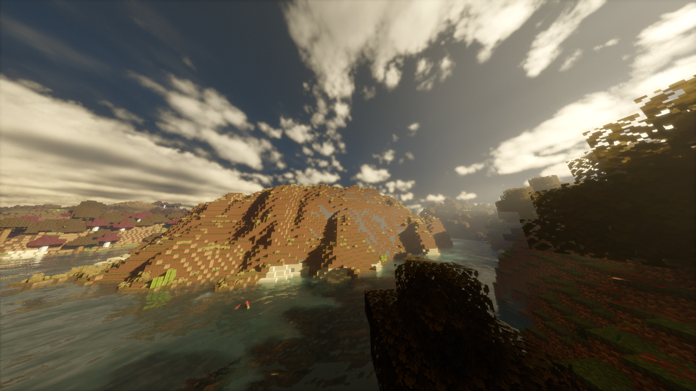

# Luminia

An edit of Bliss, which is itself an edit of Chocapic13's shaders.

I always loved Chocapic's shaders, and how customizable it was. But I wanted MORE.
I eventually started tweaking the shader, adding settings, breaking stuff, and after a while wanted to impose my own visual style onto the shader.
I wanted to emphasize a varying scene, where the lighting isn't always the same whenever or wherever you are.

### SPECIAL THANKS:
+ Chocapic13, for the base shader
+ WoMspace, for spending a lot of time creating a DOF overhaul
+ Null, for doing a huge amount of work creating the voxel floodfill colored lighting
+ Emin, and Gri573, for teaching me how to stop a lot of light leaking
+ RRe36 and Sixthsurge, for the great ideas to steal

### [Come join my discord server!](https://discord.gg/8nVt56H9zH)
### [Want to support me? Consider donating](https://ko-fi.com/xonkdev)

# RELEASE VERSIONS, STABLE VERSIONS, AND UNSTABLE VERSIONS

`Release versions` are uploaded when the stable version is... stable enough, and has enough changes to warrant a release. These are the versions uploaded to Modrinth or Curseforge. The release versions are not the very latest version.

`Stable versions` are not the absolute newest versions, but they are more stable, and are released regularly to be tested by anyone. **Please report any issues you find.**

`Unstable versions` are the ABSOLUTE latest versions, and are released very frequently and are likely to have bugs and issues or missing features. When this branch reaches a stable enough state, it is merged into the Stable branch. **Please report any issues you find.**

## How to download the `stable` version:
 - Locate the `green "Code" button` on this page (not in the `Releases` page).
 - Click the `green "Code" button` and select `"Download ZIP"`.
 - Once the zip file finishes downloading, install it like a normal shader. You do NOT need to unzip/extract/decompress.
